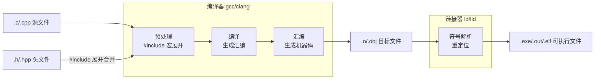

# 编译原理基础

## 编译/链接流程


## GNU(GNU's Not Unix) C/C++ Compiler

GCC是自由软件运动组织GNU的一个子项目, 是C编译器工具, 是GNU C Compiler的缩写；用于编译C和C++文件。

### gcc/g++编译

```bash
# <output_file>为输出的可执行文件或库文件
# <source_file>即为C语言代码文件, 或者编译中间产生的中间文件, 或者库文件
gcc -o <output_file.exe> <source_file.c>
g++ -o <output_file.exe> <source_file.cpp>

# lstdc++ 本质上并非库文件, 实际上是个配置选项, 代表链接时加入C++的库文件
gcc -o <output_file.exe> <source_file.c> -lstdc++
```

**E.G.**
```bash
gcc -o HelloWorld.exe HelloWorld-c.c
g++ -o HelloWorld.exe HelloWorld-cpp.cpp
gcc -o HelloWorld.exe HelloWorld-c.c -lstdc++
```
**库文件小科普**
- 库一般分静态库和动态库. 静态库在编译链接时与可执行文件合为一体, 动态库单独作为文件供可执行文件调用
  - 静态库直接装载到内存, 更占用内存资源, 但执行速度快
  - 动态库只有在用到的时候被装载到内存中, 且可以被多个不同的
程序调用. 因此节省资源, 但调用需要一定的装载时间
- 常见扩展名
  - Windows系统
    - 静态库: .lib, Library
    - 动态库: .dll, Dynamic Link Library
  - Linux系统
    - 静态库: .a, Archive
    - 动态库: .so, Shared Object

### 单个可执行文件的逐步生成

```bash
# -c为compile的缩写, 表示我们仅作编译生成目标文件, 不进行链接与生成可执行文件
gcc -o <output_file.o> -c <source_file.c>
# 该指令将目标文件链接成最终的可执行文件
gcc -o <output_file.exe> <output_file.o>
```

**E.G.**
```bash
gcc -o HelloWorld.o -c HelloWorld.c
gcc -o HelloWorld.exe HelloWorld.o
```

### 多个c文件联合生成可执行文件

```bash
gcc -o <output_file_1.o> -c <source_file_1.c>
gcc -o <output_file_2.o> -c <source_file_2.c>
gcc -o <output_file.exe> <output_file_1.o> <output_file_2.o>
```
一句话实现
```bash
# -o紧跟着的是输出的可执行文件名, 后面剩余的都是所依赖的源码文件或库文件或中间文件
gcc -o <output_file.exe> <source_file_1.c> <source_file_2.c>
```

**E.G.**
```bash
gcc -o HelloWorld.exe HelloWorld.c function.c
```

### 多个c/cpp文件联合生成可执行文件

```bash
gcc -o <output_file_1.o> -c <source_file_1.c>
g++ -o <output_file_2.o> -c <source_file_2.cpp>
gcc -o <output_file.exe> <output_file_1.o> <output_file_2.o> -lstdc++
```
一句话实现
```bash
gcc -o <output_file.exe> <source_file_1.c> <source_file_2.cpp> -lstdc++
```

**E.G.**
```bash
gcc -o test.exe test.c function.1 cpp -lstdc++
```

## Make和CMake
Make和CMake是C/C++项目构建工具。
Make根据`makefile`文件来编译C和C++文件并生成可执行文件。
CMake根据根据`CMakeLists.txt`文件来构建`makefile`文件, 进而根据`makefile`文件来编译C和C++文件并生成可执行文件文件。

下方为常见的`makefile`文件内容：
```makefile
# <demo_name>即为项目名, 用于指示一个项目
# <dependency>为依赖项, 可以是其他的项目名, 也可以是一个或多个文件. 不同文件之间需要用空格隔开
# <related_instructions>为指令名, 是一条或多条gcc等指令
# 该内容可存在多个
<demo_name>: <dependency>
    <related_instructions>
```

下方为常见的make指令：
```bash
# 按照<demo_name>的指令与配置, 编译并输出可执行文件
# 执行该指令时, make会自动寻找该路径下的makefile文件
# <demo_name>即为项目名, 用于指示一个项目
# 若make后不跟任何<demo_name>, 则默认是第一个<demo_name>
make <demo_name>
```

**E.G.**
```makefile
# 生成所有项目
all: demo_1 demo_2 demo_3 demo_4
# 1对应的项目
demo_1: ./1_test_c/test.c
    gcc -o ./1_test_c/test.exe ./1_test_c/test.c
# 2对应的项目
demo_2: ./2_test_cpp/test.cpp
    g++ -o ./2_test_cpp/test.exe
./2_test_cpp/test.cpp
# 3.1对应的项目
demo_1_step: ./1_test_c/test.c
    gcc -o test.o -c test.c
    gcc -o test.exe test.o
# 3对应的项目
demo_3: ./3_test_multi_c/test.c
./3_test_multi_c/function.c
    gcc -o ./3_test_multi_c/test.exe
./3_test_multi_c/test.c
./3_test_multi_c/function.c
# 4对应的项目
demo_4: ./4_test_multi_c_cpp/test.c
./4_test_multi_c_cpp/function.cpp
    g++ -o ./4_test_multi_c_cpp/test.exe
./4_test_multi_c_cpp/test.c
./4_test_multi_c_cpp/function.cpp
# 删除编译中间文件
clean_o:
    del /s *.o
# 删除所有编译生成文件
clean:
    del /s *.o
    del /s *.exe
```

```bash
# 生成test_c.exe
make demo_1
# 生成test_cpp.exe
make demo_2
# 生成test_c.exe和test_cpp.exe
# 也可以直接make
make all
```
